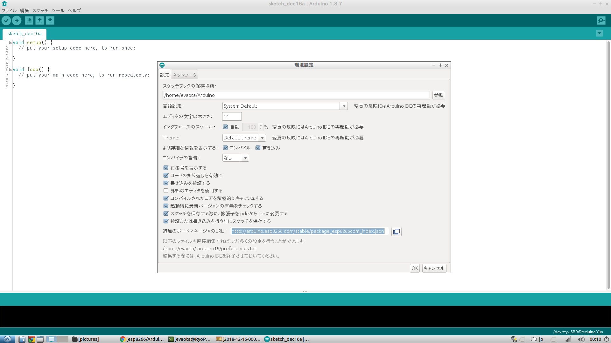
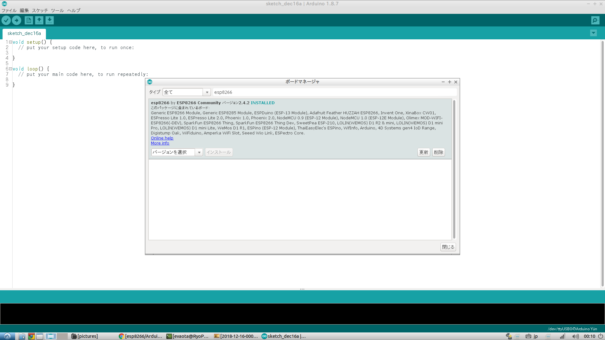
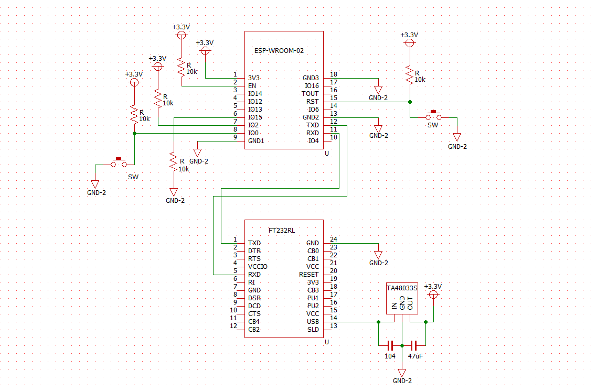

# Instruction install ESP8266 development envirment on arduino IDE

#### ***Expected Package before install Toolchain***
- git
- Leatest Arduino IDE

- ## Add ESP8266 borads on arduino

    1. input below URL in board manager URL box in enviroment configration
        > http://arduino.esp8266.com/stable/package_esp8266com_index.json   

        
    2. install esp8266 board 
        

- ## How to write program
モード									GPIO15	GPIO2	GPIO0
書き込みモード(UART Download Mode)	Low	High	Low
実行モード(Flash Boot Mode)			Low	High	High
SDブートモード(SD-Card Boot Mode)		High	Low	Low

書き込みの方法
PIO0をLOWにしながらリセットする。

- ## Hardware difinition as Arduino(japanese)
    - [use ESP8266 as arduino](https://keijirotanabe.github.io/blog/2017/02/08/esp8266-how-to-170208/)   

- ## API Reference and other documents
    <!-- Access [Espressif ESP32 official site](https://docs.espressif.com/projects/esp-idf/en/latest/get-started/linux-setup.html) -->

- ## How to use RTOS for ESP8266
    - [exsample using RTOS](https://44781184.at.webry.info/201601/article_6.html)
- ## NOTE
    - ### truble shooting
        https://www.mgo-tec.com/blog-entry-esp8266-wroom-02-espr-developer-trouble-shooting.html
    - ### Online configration for SSID password of WiFi
        http://takehikoshimojima.tumblr.com/post/138820924644/esp8266-wi-fi-ssid%E3%83%91%E3%82%B9%E3%83%AF%E3%83%BC%E3%83%89%E3%81%AE%E3%82%AA%E3%83%B3%E3%83%A9%E3%82%A4%E3%83%B3%E8%A8%AD%E5%AE%9A
    - ### more information of ESP8266
        https://macsbug.wordpress.com/2015/06/21/information-of-esp8266-%E9%9A%8F%E6%99%82%E8%BF%BD%E5%8A%A0/

- ## sample codes
    ~~~c++
    
    ~~~

- ## Version

    |version  |Date|Contents|
    |:-----:|:-------:|:----------------|
    |ver1.0 |2018/12/15|add infomation of version|   

- ## License Information
   This software is released under the MIT License, see LICENSE