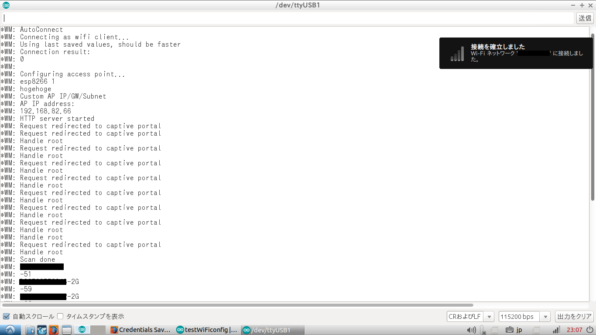
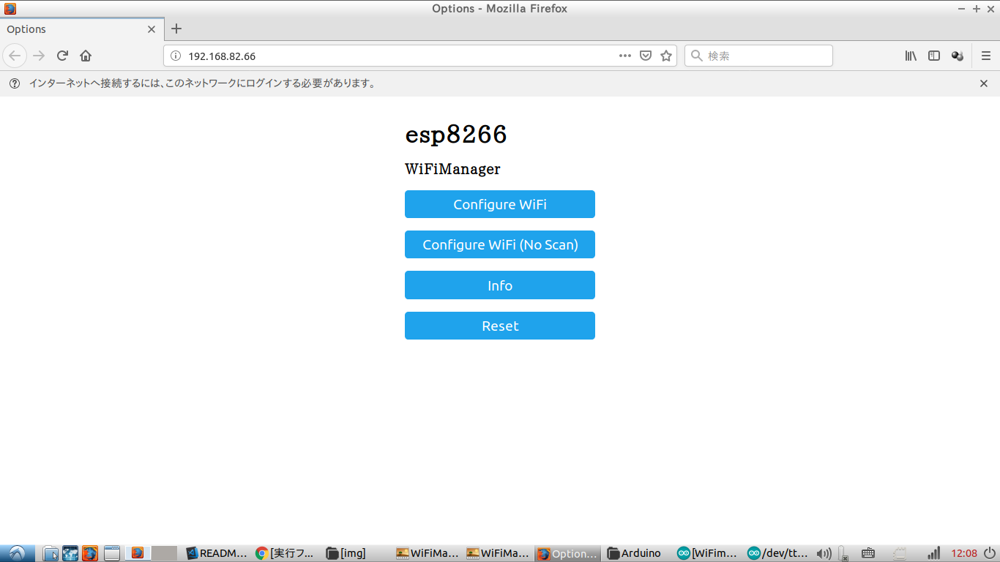
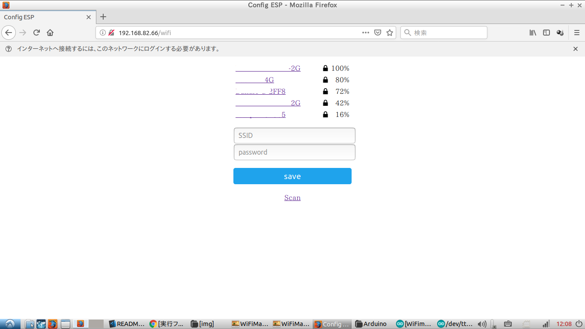
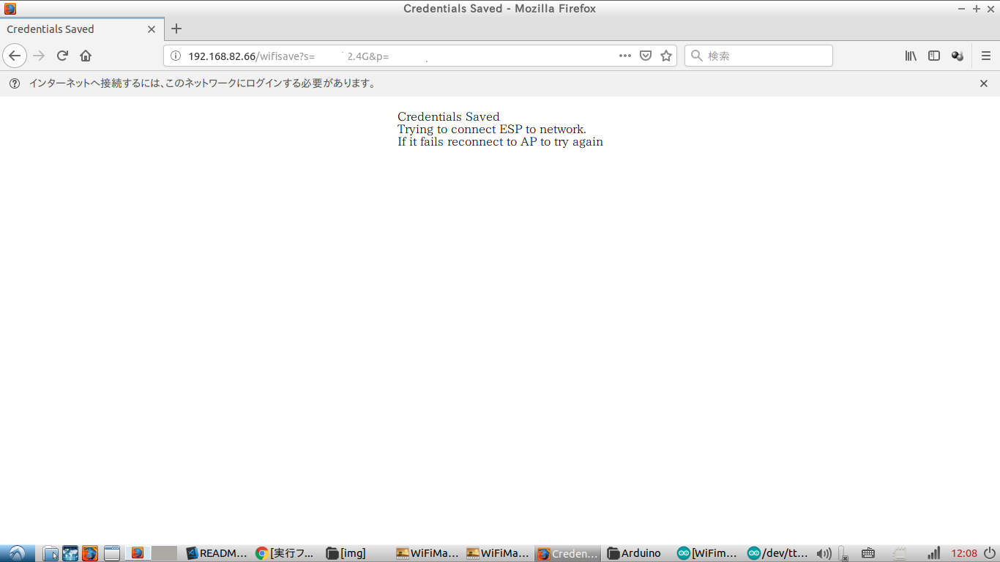
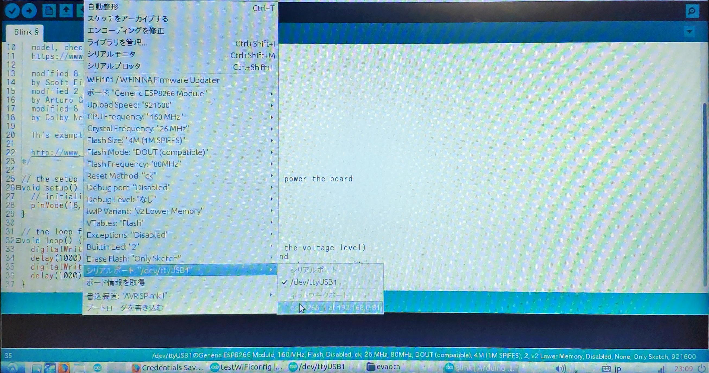
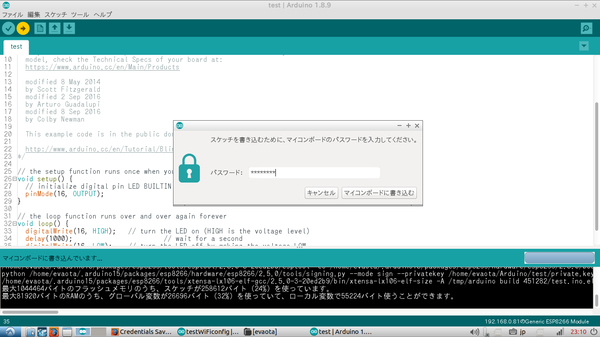
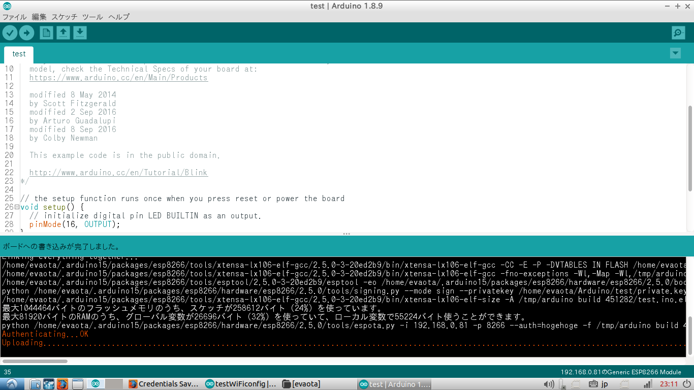

# WiFi Manager & Arduino OTA for ESP8266 

- ## What's this?
    Easily connect to Access Point and Upload arduino program via UDP to ESP8266 using WiFiManager library by tzapu and ArduinoOTA standard library

- ## How to Use?
    1. Copy [sample program](./WiFimanageOTA.ino) in other file, Write own program to it.
    1. Set up parameters of macro defined.Show parameter table.    
    
        |parameter|type|default|remark|    
        |:--|:--:|:--|:--:|    
        |_MANAGER_SSID|string|"esp8266"| |
        |_MANAGER_PSK|string|"password"||
        |_MANAGER_TIMEOUT|int|120||
        |_MANAGER_IP|ip|IPAddress(192,168,82,66)||
        |_MANAGER_GATEWAY|ip|IPAddress(192,168,82,1)||
        |_MANAGER_SUBNET|ip|IPAddress(255,255,255,0)||
        |_OTA_HOSTNAME|string|"esp8266"||
        |_OTA_PASSWORD|string|"password"||
        |_OTA_PORT|int|8266||
    1. Write user program    
    1. Upload executable file via UART 
    1. Open Serial Monitor.If you did not setup AP setting, will be displayed message of "Configuring access point...".    
    Check access point and connect to input password.
        
    1. Access http://192.168.82.66(Accessd by FireFox)
        
    1. Click "Configure WiFi"   
        Input SSID and password of AP that ESP8266 connect to it  
        
        
    1. OTA upload   
        When you upload program via OTA,select "esp8266 at 192.168.0.xx "of Serial port in Tool bar
        
        Click Upload Button. After complete to compile, will be displayed window to input password for OTA.
        
        After password matched, will be started to upload. 
        
        After complete to upload,ESP8266 makes to restart program.

        **NOTE:WiFi Configuration will be saved at EEPROM, setupping WiFi configuration will be unnecessary again**

- ## Default Specifications
    
    |contents|parameter|    
    |:--|:--:|    
    |Serial baud-rate|115200bps|
    |Access Point(AP) SSID|"esp8266"|
    |Access Point(AP) passpword|"password"|
    |_MANAGER_TIMEOUT|120|
    |AP IP address|192.168.82.66|
    |AP Gateway|192.168.82.1|
    |AP Subnet|255.255.255.0|
    |OTA Host name|"esp8266"|
    |OTA password|"password"|
    |OTA UDP port number|8266|

- ## Option parameter
    - ### Reset button for WiFi manager setting   
        If you need to reset WiFi manager setting, Change parameter of "MANAGER_RST_SETTING" from "_DISABLE" to "_ENABLE".
        If the pin assined is low when power on, previous manager setting will be cleard.

        |contents|explanation|default|    
        |:--|:--|:--:|    
        |MANAGER_RST_SETTING|When "_ENABLE" ,will be enable |_DISABLE|
        |_MANAGER_RST_PIN|Power on while this pin make low,will be reset manager setting (active Low)|2|

    - ### OTA indicator   
        If you need to indicate OTA state using LED, Change parameter of "_OTA_INDICATE_LED" from "_DISABLE" to "_ENABLE".

        |contents|explanation|default|    
        |:--|:--|:--:|    
        |_OTA_INDICATE_LED|indicate OTA upload|_DISABLE|
        |_OTA_STATUS_PIN|The LED flashes during OTA operation|16|
        |_OTA_ERROR_PIN|hen Error ocoued, the LED turns on. Check Serial message|13|
        - ## NOTE    
            **Two LEDs will be light when LOW** 

- ## Sketch Cost
    Conditions : non indicator and non reset button
    ~~~
    The sketch uses 337,728 bytes (32%) of the flash memory of up to 1044464 bytes.
    Of the up to 81920 bytes of RAM, global variables can use 32860 bytes (40%) and local variables can use 49060 bytes.
    ~~~
- ## Reference Articles

    - WiFiManager by tzapu   
        https://github.com/tzapu/WiFiManager   
        [ESP8266 WI-FI SSID、パスワードのオンライン設定](http://takehikoshimojima.tumblr.com/post/138820924644/esp8266-wi-fi-ssid%E3%83%91%E3%82%B9%E3%83%AF%E3%83%BC%E3%83%89%E3%81%AE%E3%82%AA%E3%83%B3%E3%83%A9%E3%82%A4%E3%83%B3%E8%A8%AD%E5%AE%9A)

    - OTA update   
        [基本的なOTAアップデートの使い方](https://garretlab.web.fc2.com/arduino/esp32/examples/ArduinoOTA/ArduinoOTA_BasicOTA.html)   
        [ESP8266 ARDUINO、WI-FI経由のプログラムアップロード OTA](http://takehikoshimojima.tumblr.com/post/139096221524/esp8266-arduinowi-fi%E7%B5%8C%E7%94%B1%E3%81%AE%E3%83%97%E3%83%AD%E3%82%B0%E3%83%A9%E3%83%A0%E3%82%A2%E3%83%83%E3%83%97%E3%83%AD%E3%83%BC%E3%83%89-ota)

    - other   
        [ESP32 WifiManagerで自動接続できなかった場合の対処法](https://kunsen.net/2018/06/09/post-359/)  